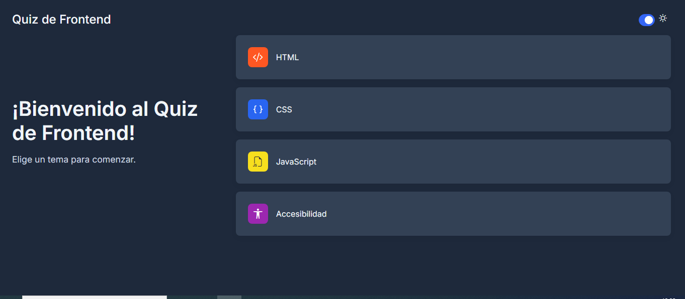
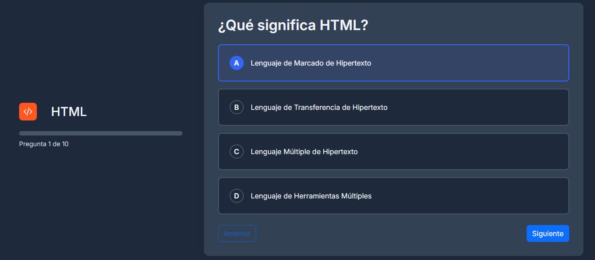
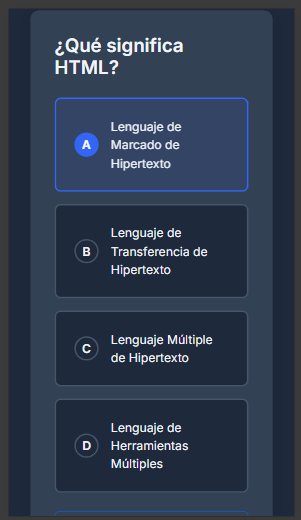

# Quiz App 🚀

## 📋 Objetivo

El objetivo de este proyecto es aprender a crear una página web dinámica utilizando el **Document Object Model (DOM)**, permitiendo la manipulación de elementos HTML a través de JavaScript.

---

## 🛠️ Tecnologías Utilizadas

-  **HTML5**
-  **CSS3**
-  **JavaScript**
-  **Vite**
-  **Vitest**

---


## 📥 Instalación de dependencias

```bash
npm install
```

---

## 🧪 Ejecutar las pruebas

```bash
npm run test
```
## 🏃 Correr la aplicacion
```bash
npx vite
```
---

## 💻 Estructura básica del proyecto

- `index.html` — Página principal.
- `js/script.js` — Lógica principal de manipulación del DOM.
- `js/` — Lógica de la aplicación (quiz, almacenamiento, resultados, etc).
- `test/` — Pruebas automatizadas con Vitest.
- `styles/` —  Archivos CSS para estilos.

---

## ✨ Funcionalidades principales

Esta página permite seleccionar una categoría de preguntas y realizar un quiz interactivo. El usuario puede navegar entre preguntas, seleccionar respuestas, ver su progreso y obtener un resumen de resultados al finalizar. El sistema guarda el avance, permite reanudar un quiz pendiente, soporta cambio de tema (claro/oscuro) y muestra el historial de resultados. Toda la manipulación de la interfaz y la lógica del quiz se realiza dinámicamente usando JavaScript y el DOM. Incluye pruebas automatizadas para asegurar la calidad del código.

Además, la aplicación es **responsive**, adaptándose automáticamente a diferentes tamaños de pantalla y dispositivos móviles para una experiencia óptima en cualquier entorno.

---

## 🖼️ Capturas de pantalla


<p align="center">
  
  
  
</p>

---

## 👥 Integrantes (6)

- Franklin Rony Cortez Barrera (k20250003)
- Nombre 2
- Nombre 3
- Nombre 4
- Nombre 5
- Nombre 6

---


